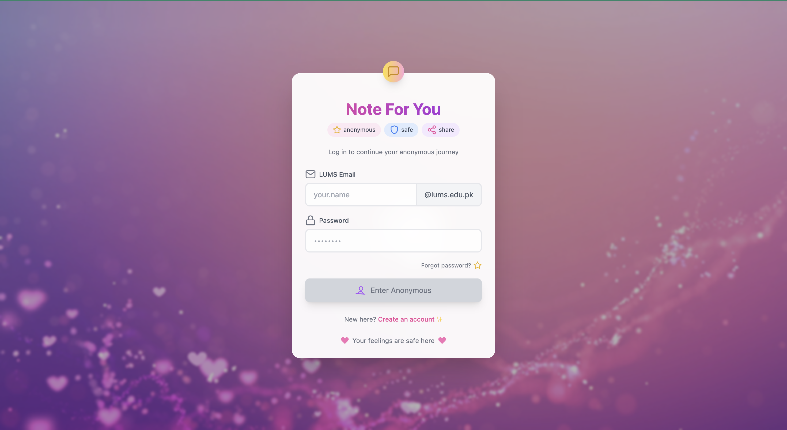
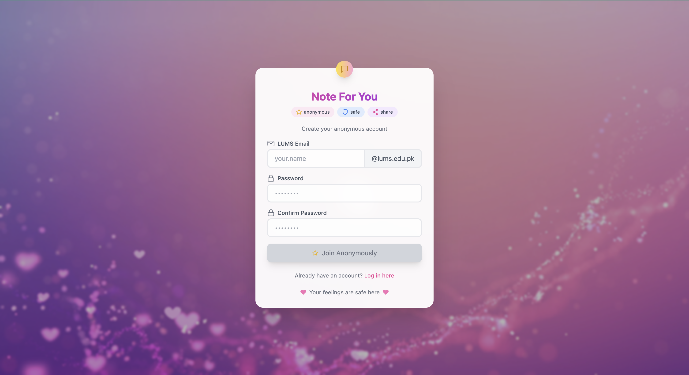
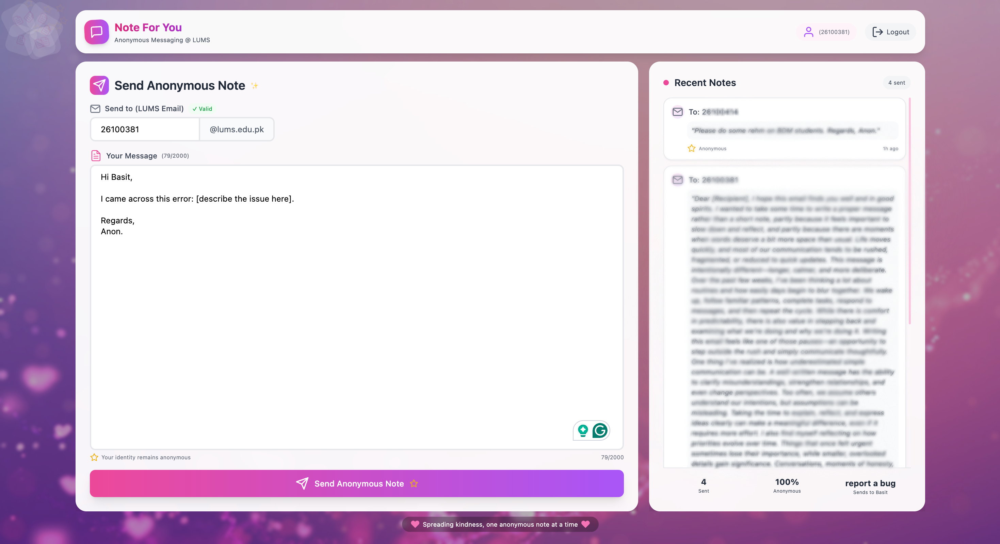
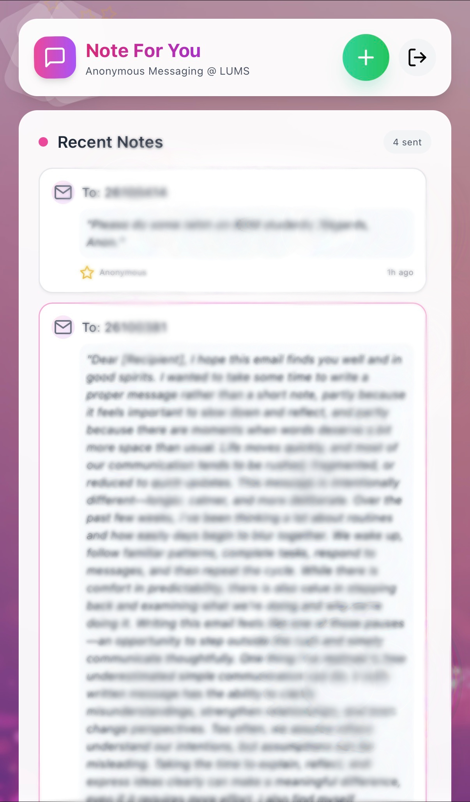

# Note For You

Anonymous note-sharing for LUMS students. Send notes to coursemates, batchmates, roommates, or anyone at LUMS without revealing who sent them. Replies are planned for a future version.

**Quick Links**

- Live app: https://noteforyou.up.railway.app
- Recorded demo of how to use the app: https://youtube.com/watch?v=REPLACE_ME

---

## Features

- LUMS-only access via @lums.edu.pk verification
- Anonymous notes with sender privacy
- Works across devices and browsers
- View your sent notes in one place

## Tech Stack

| Layer | Tech |
| --- | --- |
| Frontend | React, TypeScript, Tailwind CSS |
| Backend | FastAPI, Python, SQLAlchemy |
| Database | PostgreSQL |
| Auth | JWT access/refresh tokens, OTP email verification |
| Hosting | Railway |

## Setup and Run (Source Code Private)

The production app is live at the demo link above. The source code is not public at this time. If you need access for review or collaboration, please contact the maintainers.

## Screenshots

### Login

### Signup

### Main

### More Screens

## Roadmap

- Anonymous replies (v2.0)
- Improved note discovery and search
- Enhanced moderation and reporting

## Contributing

This repository is currently documentation-only. If you want to contribute, open an issue or contact the maintainers for access.

## License

All rights reserved. See the copyright notice below.

## Copyright

Copyright (c) 2026 Basit and Abid. All rights reserved.